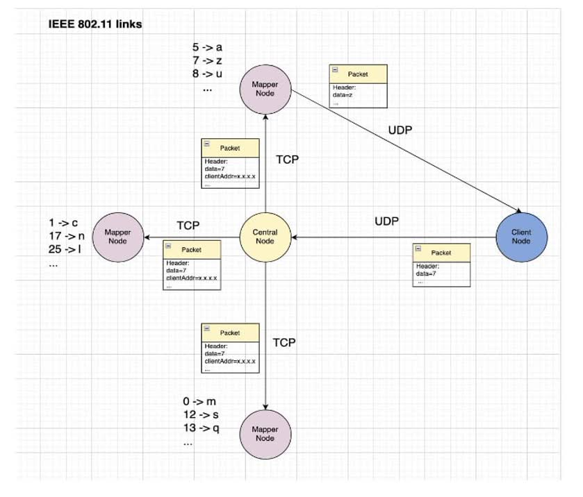
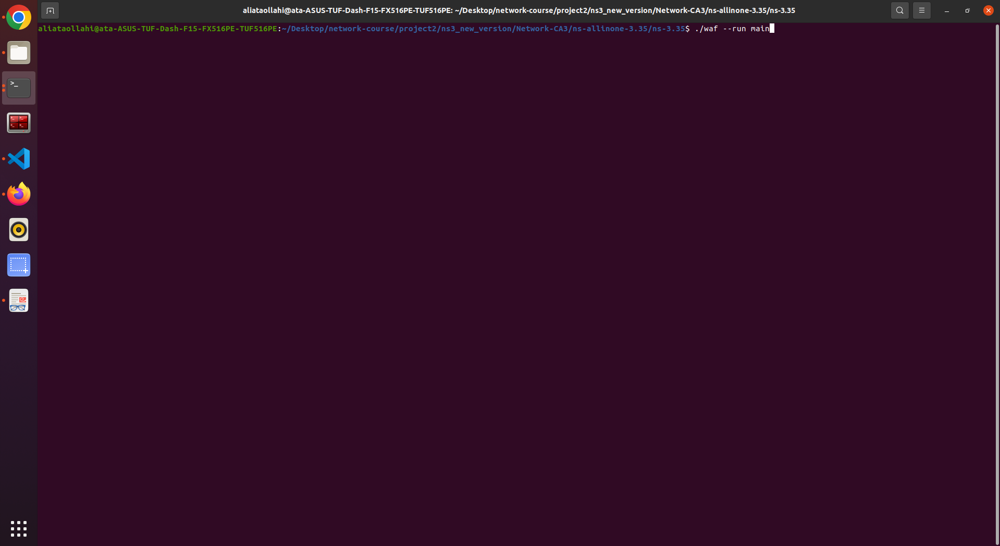
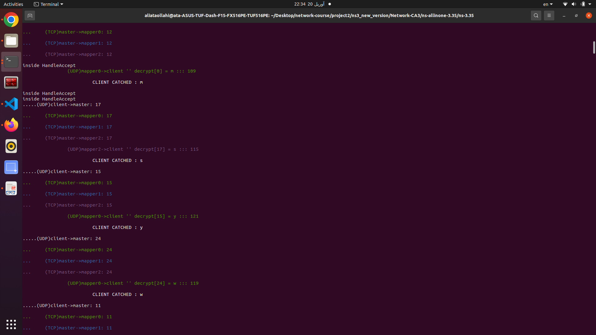
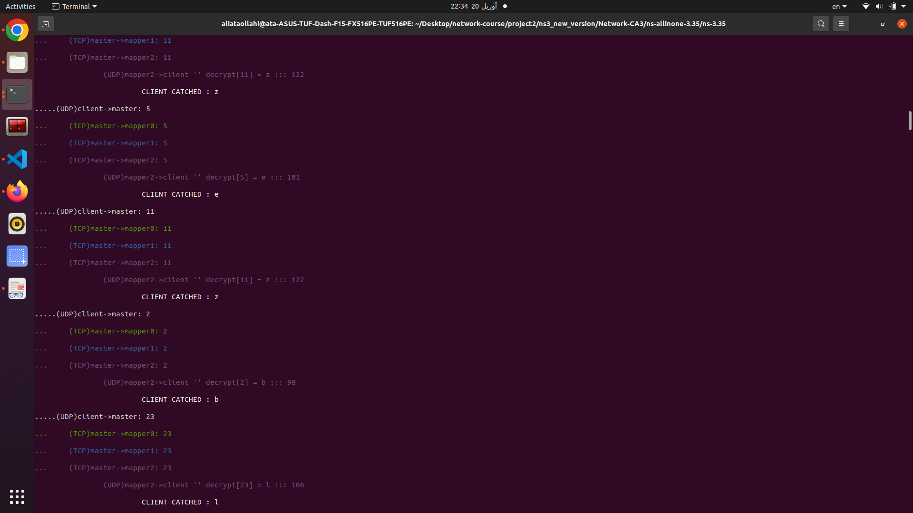
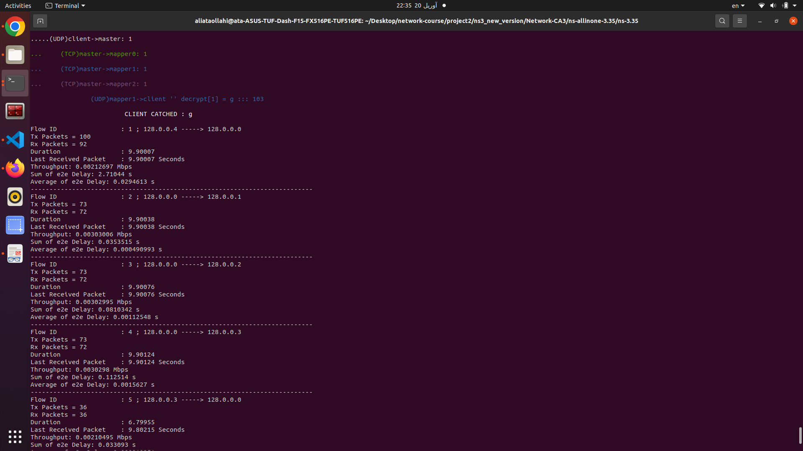
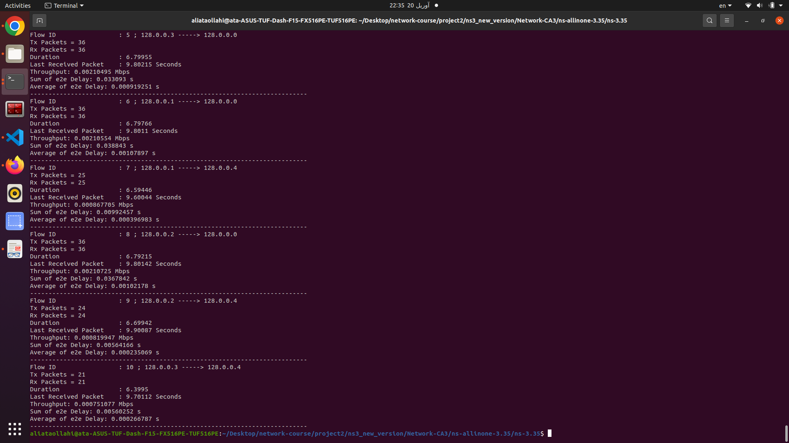

# In the Name of God

Mohammad Mohajel Sadegi - 810199483

Ali Ataollahi - 810199461

CA2

## Description
---


### NS-3
---


ns-3 is a discrete-event network simulator for Internet systems, targeted primarily for research and educational use. ns-3 is free, open-source software, licensed under the GNU GPLv2 license, and maintained by a worldwide community.

### IEEE 802.11
---


IEEE 802.11 is part of the IEEE 802 set of local area network (LAN) technical standards, and specifies the set of media access control (MAC) and physical layer (PHY) protocols for implementing wireless local area network (WLAN) computer communication. The standard and amendments provide the basis for wireless network products using the Wi-Fi brand and are the world's most widely used wireless computer networking standards. IEEE 802.11 is used in most home and office networks to allow laptops, printers, smartphones, and other devices to communicate with each other and access the Internet without connecting wires.

### Network Topology
---


`Client generates random traffic of data between 0 - 25`
`and sends it to master(central) node using **UDP**.`

`After that, master node sends that data to mapper nodes using **TCP**.`

`And finally one of mapper nodes respondes to client.`


you can see schema of network topology below




## parameters
---


#### Tx Packets
---


displays the number of transmitted packets

#### Rx Packets
---


displays the number of received packets

#### Throughput
---


number of received packets / Duration

#### Average end-to-end delay
---


Sum of end to end Delay / number of received packets

## Analysis With Parameters
---
```
Flow ID			: 1 ; 128.0.0.4 -----> 128.0.0.0
Tx Packets = 100
Rx Packets = 92
Duration		: 9.90007
Last Received Packet	: 9.90007 Seconds
Throughput: 0.00212697 Mbps
Sum of e2e Delay: 2.71041 s
Average of e2e Delay: 0.029461 s
---------------------------------------------------------------------------
Flow ID			: 2 ; 128.0.0.0 -----> 128.0.0.1
Tx Packets = 73
Rx Packets = 72
Duration		: 9.90035
Last Received Packet	: 9.90035 Seconds
Throughput: 0.00303007 Mbps
Sum of e2e Delay: 0.0345444 s
Average of e2e Delay: 0.000479784 s
---------------------------------------------------------------------------
Flow ID			: 3 ; 128.0.0.0 -----> 128.0.0.2
Tx Packets = 73
Rx Packets = 72
Duration		: 9.90067
Last Received Packet	: 9.90067 Seconds
Throughput: 0.00302998 Mbps
Sum of e2e Delay: 0.0772345 s
Average of e2e Delay: 0.0010727 s
---------------------------------------------------------------------------
Flow ID			: 4 ; 128.0.0.0 -----> 128.0.0.3
Tx Packets = 73
Rx Packets = 72
Duration		: 9.90115
Last Received Packet	: 9.90115 Seconds
Throughput: 0.00302983 Mbps
Sum of e2e Delay: 0.108129 s
Average of e2e Delay: 0.0015018 s
---------------------------------------------------------------------------
Flow ID			: 5 ; 128.0.0.3 -----> 128.0.0.0
Tx Packets = 36
Rx Packets = 36
Duration		: 6.79943
Last Received Packet	: 9.80203 Seconds
Throughput: 0.00210499 Mbps
Sum of e2e Delay: 0.0308677 s
Average of e2e Delay: 0.000857436 s
---------------------------------------------------------------------------
Flow ID			: 6 ; 128.0.0.1 -----> 128.0.0.0
Tx Packets = 36
Rx Packets = 36
Duration		: 6.79748
Last Received Packet	: 9.80092 Seconds
Throughput: 0.0021056 Mbps
Sum of e2e Delay: 0.0311482 s
Average of e2e Delay: 0.000865228 s
---------------------------------------------------------------------------
Flow ID			: 7 ; 128.0.0.1 -----> 128.0.0.4
Tx Packets = 28
Rx Packets = 28
Duration		: 6.7945
Last Received Packet	: 9.80049 Seconds
Throughput: 0.000943217 Mbps
Sum of e2e Delay: 0.0104466 s
Average of e2e Delay: 0.000373093 s
---------------------------------------------------------------------------
Flow ID			: 8 ; 128.0.0.2 -----> 128.0.0.0
Tx Packets = 36
Rx Packets = 36
Duration		: 6.79206
Last Received Packet	: 9.80134 Seconds
Throughput: 0.00210728 Mbps
Sum of e2e Delay: 0.0370502 s
Average of e2e Delay: 0.00102917 s
---------------------------------------------------------------------------
Flow ID			: 9 ; 128.0.0.2 -----> 128.0.0.4
Tx Packets = 23
Rx Packets = 23
Duration		: 6.79915
Last Received Packet	: 9.90081 Seconds
Throughput: 0.000774256 Mbps
Sum of e2e Delay: 0.00495161 s
Average of e2e Delay: 0.000215287 s
---------------------------------------------------------------------------
Flow ID			: 10 ; 128.0.0.3 -----> 128.0.0.4
Tx Packets = 19
Rx Packets = 19
Duration		: 6.29986
Last Received Packet	: 9.60147 Seconds
Throughput: 0.000690294 Mbps
Sum of e2e Delay: 0.00527448 s
Average of e2e Delay: 0.000277604 s
---------------------------------------------------------------------------

```

#### Throughput
---
We calculate throughput with this formula:


$ numberOfPacketsRecieved = Rx_{mapper1->client} + Rx_{mapper2->client} + Rx_{mapper3->client} = 28 + 36 + 19 = 70$

$ throughput = numberOfPacketsRecieved / duration $

$ = 70 / (max(LRP_{mapper1}, LRP_{mapper2}, LRP_{mapper3}) - 0.0) $

$ throughput = 70 / 9.90081 = 7.070128606 packet/s$

$ throughput = 7.070128606 * 8 / 1024^2 = 0.000053941 Mbps$

Note : $ Rx_{client->master} > numberOfPacketsRecieved => 92 > 70 $

#### Average end-to-end delay
---
End-to-end delay or one-way delay (OWD) refers to the time taken for a packet to be transmitted across a network from source to destination:

$ Average delay = SumOfDelayForPacketsSentFromSourceToDest / numberOfPacketsRecieved$

$ 0.029461 + (0.000479784 + 0.000373093)28/70 + (0.00102917 + 0.000215287)23/70 + (0.0015018 + 0.000277604)19/70 = 0.030694025$


#### Connections
---

duration = 10 seconds
mappers num = 3

For tcp connection we set this params:

    "ns3::GridPositionAllocator",
    "MinX", DoubleValue (0.0),
    "MinY", DoubleValue (0.0),
    "DeltaX", DoubleValue (0.0),
    "DeltaY", DoubleValue (0.1),
    "GridWidth", UintegerValue (4),
    "LayoutType", StringValue ("RowFirst")

we have totall of 10 connections in our topology which you can see below


`**CLient Node Address**  ::  128.0.0.4`
`**Master Node Address**  ::  128.0.0.0`
`**Mapper1 Node Address** ::  128.0.0.1`
`**Mapper2 Node Address** ::  128.0.0.2`
`**Mapper3 Node Address** ::  128.0.0.3`

We have totall of 1 + 6 + 3 connections in our topology 

1 **UDP** from client to master

6 **TCP** from master to 3 mappers (connection from both sides is required in **TCP**) 

3 **UDP** from mappers to client


## Utils
---


### NodeContainer

`You should think of a Node as a computer to which you will add functionality. One adds things like applications,`
`protocol stacks and peripheral cards with their associated drivers to enable the computer to do useful work. We use`
`the same basic model in ns-3.`

```cpp
NodeContainer client_node_container;
client_node_container.Create (1);

NodeContainer master_node_container;
master_node_container.Create (1);

NodeContainer mapper_node_container;
mapper_node_container.Create (3);
```

### Channel

`The Channel class provides methods for managing communication subnetwork objects and connecting nodes to them.`
`Channels may also be specialized by developers in the object oriented programming sense.`

#### YansWifiChannelHelper

```cpp
YansWifiChannelHelper channel_helper = YansWifiChannelHelper::Default ();
```


#### YansWifiPhyHelper

```cpp
YansWifiPhyHelper phy_helper;
phy_helper.SetChannel (channel_helper.Create ());
```

#### WifiHelper

```cpp
WifiHelper wifi_helper;
wifi_helper.SetRemoteStationManager ("ns3::AarfWifiManager");
```

#### WifiMacHelper

```cpp
WifiMacHelper mac_helper;
Ssid ssid = Ssid ("ns-3-ssid");
mac_helper.SetType ("ns3::StaWifiMac",
             "Ssid", SsidValue (ssid),
             "ActiveProbing", BooleanValue (false));
```

### NetDeviceContainer

`In ns-3 the net device abstraction covers both the software driver and the simulated hardware. A net device is “installed”`
`in a Node in order to enable the Node to communicate with other Nodes in the simulation via Channels. Just`
`as in a real computer, a Node may be connected to more than one Channel via multiple NetDevices.`

```cpp
NetDeviceContainer client_ap_device_container;
client_ap_device_container = wifi_helper.Install (phy_helper, mac_helper, client_node_container);

mac_helper.SetType ("ns3::ApWifiMac", "Ssid", SsidValue (ssid));

NetDeviceContainer client_device_container;
client_device_container = wifi_helper.Install (phy_helper, mac_helper, client_node_container);

mac_helper.SetType ("ns3::StaWifiMac","Ssid", SsidValue (ssid), "ActiveProbing", BooleanValue (false));

NetDeviceContainer master_device_container;
master_device_container = wifi_helper.Install (phy_helper, mac_helper, master_node_container);

mac_helper.SetType ("ns3::StaWifiMac","Ssid", SsidValue (ssid), "ActiveProbing", BooleanValue (false));

NetDeviceContainer mapper_device_container;
mapper_device_container = wifi_helper.Install (phy_helper, mac_helper, mapper_node_container);
```

### Mobility

```cpp
MobilityHelper mobility;

mobility.SetPositionAllocator ("ns3::GridPositionAllocator",
                               "MinX", DoubleValue (0.0),
                               "MinY", DoubleValue (0.0),
                               "DeltaX", DoubleValue (0.0),
                               "DeltaY", DoubleValue (0.1),
                               "GridWidth", UintegerValue (4),
                               "LayoutType", StringValue ("RowFirst"));

mobility.SetMobilityModel ("ns3::RandomWalk2dMobilityModel",
                           "Bounds", RectangleValue (Rectangle (-50, 50, -50, 50)));
mobility.Install (client_node_container);

mobility.SetMobilityModel ("ns3::ConstantPositionMobilityModel");
mobility.Install (master_node_container);

mobility.SetMobilityModel ("ns3::ConstantPositionMobilityModel");
mobility.Install (mapper_node_container);
```

### InternetStackHelper

```cpp
InternetStackHelper stack;
stack.Install (client_node_container);
stack.Install (master_node_container);
stack.Install (mapper_node_container);
```

### Ipv4AddressHelper

```cpp
Ipv4AddressHelper address;
```

### Ipv4InterfaceContainer

```cpp
unordered_map<int, Ipv4InterfaceContainer> interfaces;
Ipv4InterfaceContainer staNodesMasterInterface = address.Assign(master_device_container);
Ipv4InterfaceContainer staNodesMapperInterface = address.Assign(mapper_device_container);
Ipv4InterfaceContainer staNodesClientInterface = address.Assign(client_device_container);
```

### Applications

`Just as software applications run on computers `
`to perform tasks in the “real world,” ns-3 applications run on `
`ns-3 Nodes to drive simulations in the simulated world`

#### Client

```cpp
class client : public Application
{
public:
    client (uint16_t port, unordered_map<int, Ipv4InterfaceContainer>& interfaces_);
    virtual ~client ();

private:
    virtual void StartApplication (void);
    void HandleRead (Ptr<Socket> socket);


    unordered_map<int, Ipv4InterfaceContainer> interfaces;

    uint16_t port;
    Ptr<Socket> socket;
    vector<Ptr<Socket>> mappers_sockets;
    vector<InetSocketAddress> mappers_sockets_address;

    Ptr<Socket> mapper_0_socket;
    Ptr<Socket> mapper_1_socket;
    Ptr<Socket> mapper_2_socket;

};
```

#### Master

```cpp
class master : public Application
{
public:
    master (uint16_t port, unordered_map<int, Ipv4InterfaceContainer>& interfaces_);
    virtual ~master ();
private:
    virtual void StartApplication (void);
    void HandleRead (Ptr<Socket> socket);
    unordered_map<int, Ipv4InterfaceContainer> interfaces;
    uint16_t port;
    
    Ptr<Socket> socket;
    vector<Ptr<Socket>> mappers_sockets;
    vector<InetSocketAddress> mappers_sockets_address;
};
```

#### Mapper

```cpp
class mapper : public Application
{
public:
    mapper (uint16_t port, unordered_map<int, Ipv4InterfaceContainer>& interfaces_, int mapper_number);
    virtual ~mapper ();
private:
    virtual void StartApplication (void);
    void HandleRead (Ptr<Socket> socket);
    void HandleAccept(Ptr<Socket> sock, const Address & addr);
    unordered_map<int, Ipv4InterfaceContainer> interfaces;

    int mapper_number;
    string color;

    uint16_t port;
    Ptr<Socket> socket;
    Ptr<Socket> client_socket;
};
```


## Test Screenshots





