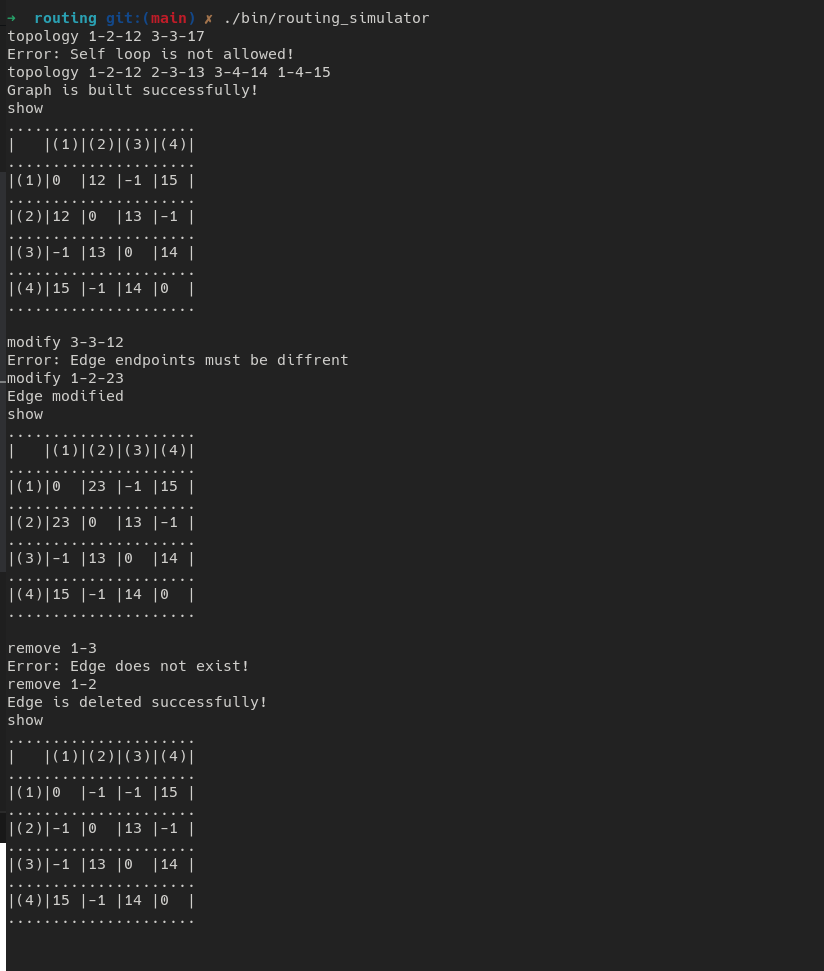
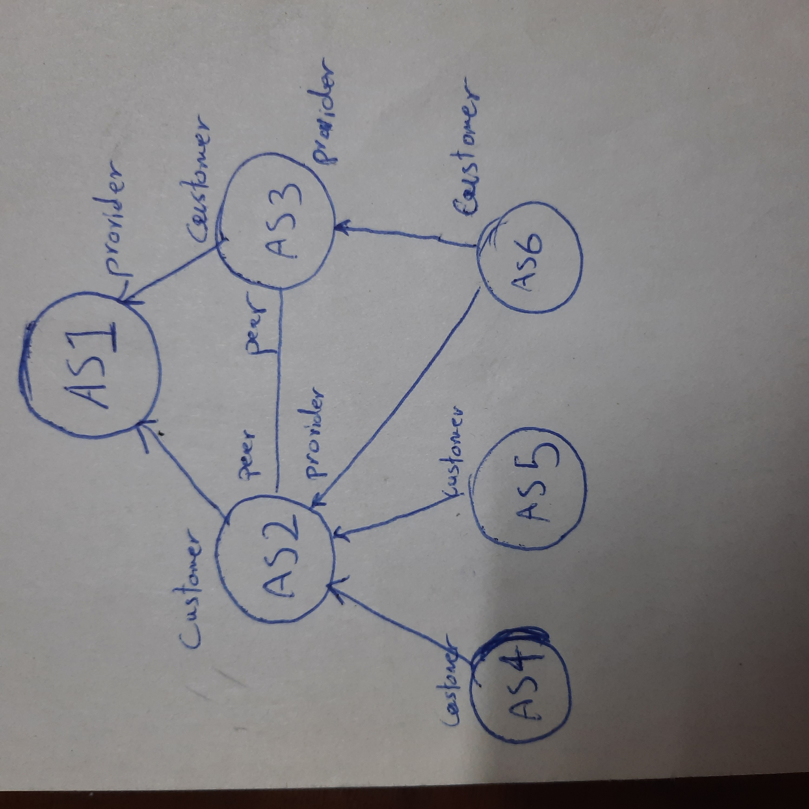
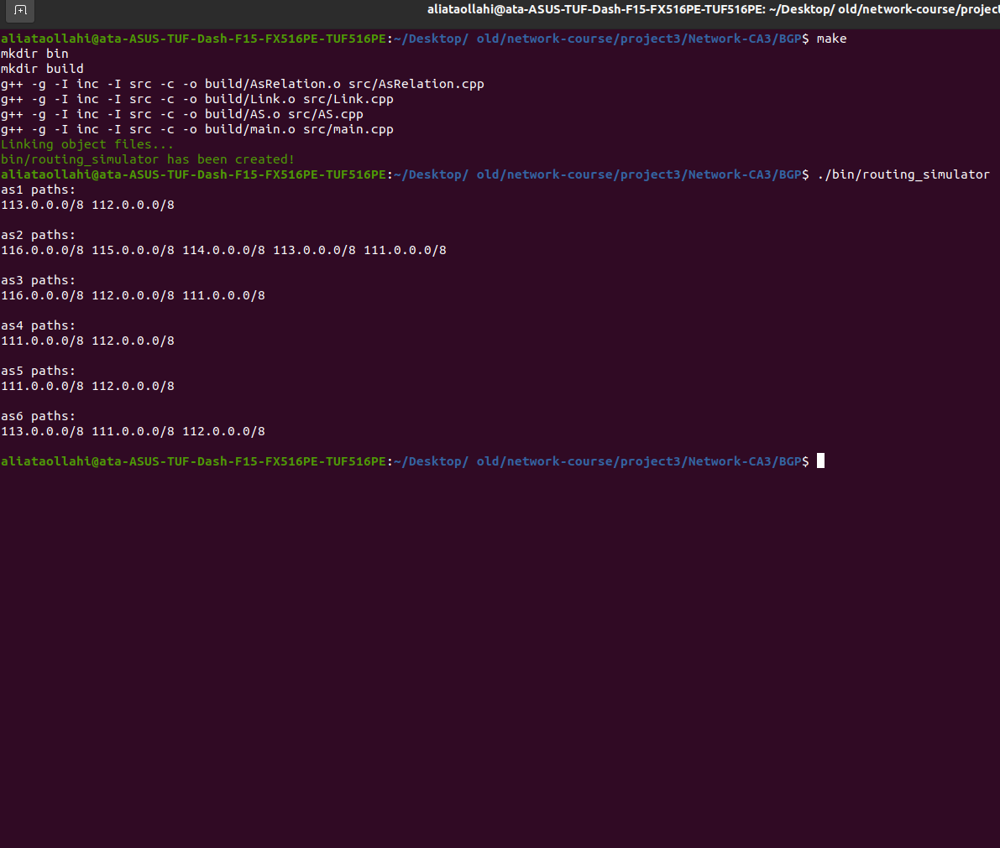
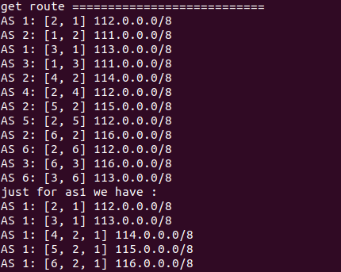
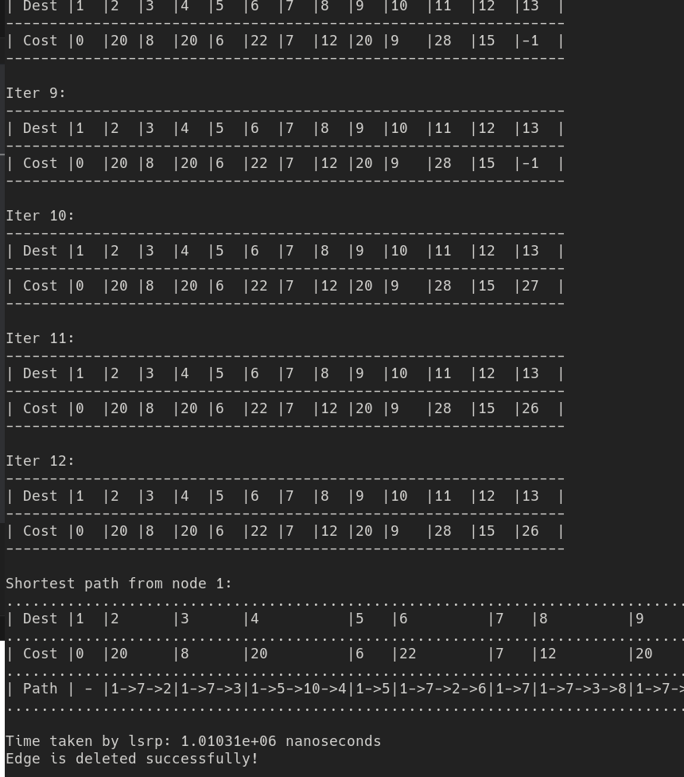
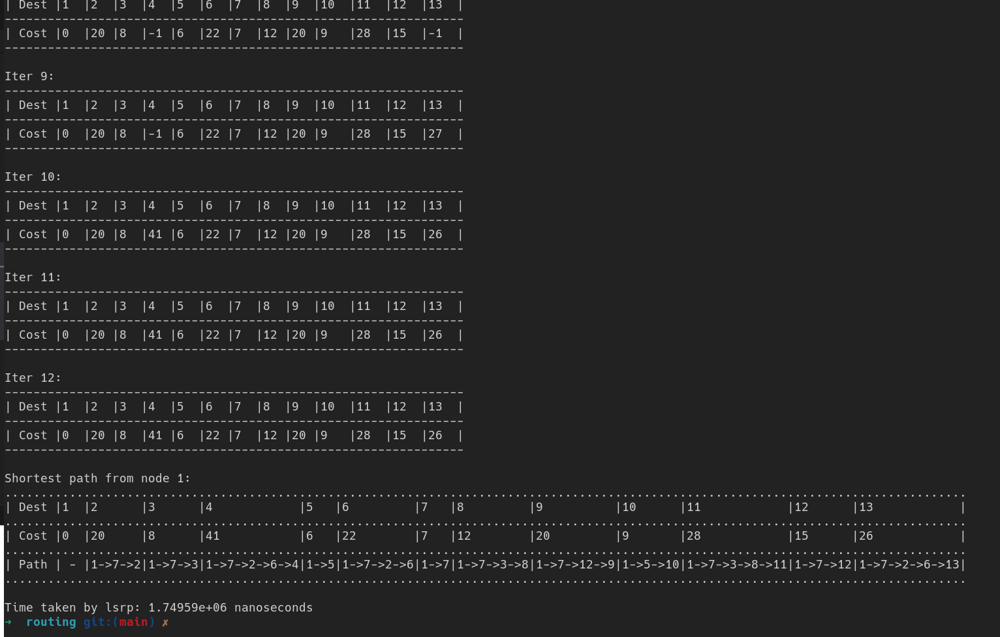
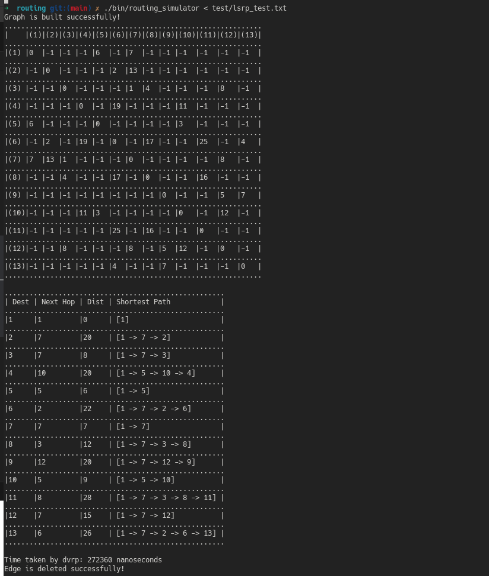
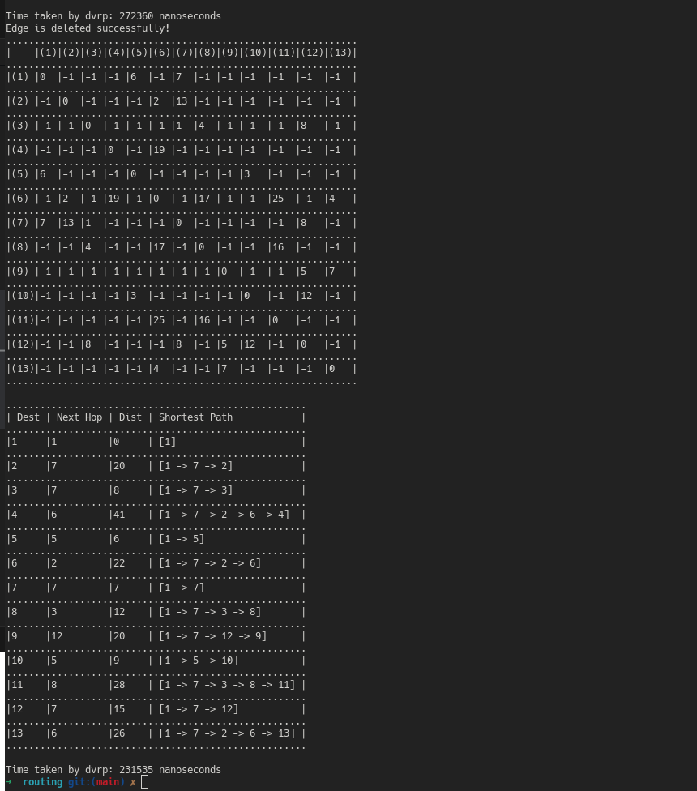

# In the Name of God

* Mohammad Mohajel Sadegi - 810199483 

* Ali Ataollahi - 810199461 

# Network Routing Protocols

In this project, we impelemnt simple abstraction of Bourder Gaeway Protocol(BGP), Link State Routing Protocol(LSRP), Distance Vector Routing Protocol(DVRP).

## Test:

we use following commands in order to create our network topology
* topology
* show
* modify
* remove

you can see complete use of this functionalities and handling their errors below:



# Phase1: Bourder Gaeway Protocol(BGP)

BGP, or Border Gateway Protocol, is the protocol used to exchange routing information between different autonomous systems (AS) on the Internet. It is designed to allow routers in one AS to inform routers in other ASes about the reachability of IP addresses it can reach within its own network.

BGP is a path-vector protocol, which means that it makes routing decisions based on a number of factors, including the number of autonomous systems that traffic must traverse to reach a given destination, as well as other metrics such as local preference, weight, and MED.

BGP is widely used in large-scale networks, such as those operated by Internet service providers (ISPs), as well as in enterprise networks with multiple locations or data centers. Properly configuring BGP is critical for ensuring efficient and reliable routing of traffic across the Internet.


## About RFC4271

It is the protocol used to exchange routing information between different autonomous systems (AS) on the Internet. This RFC, titled "A Border Gateway Protocol 4 (BGP-4)", was published in January 2006 and is the most up-to-date specification for BGP.

The BGP-4 protocol described in RFC 4271 is designed to be scalable, flexible, and robust, capable of handling large volumes of routing information in a complex network environment. It includes features such as route aggregation, prefix filtering, policy-based routing, and support for multiple address families.

RFC 4271 also describes the basic message format and operation of BGP, including how routers exchange routing information, how routing decisions are made, and how routes are advertised and withdrawn. It provides guidelines for configuring BGP and for troubleshooting common problems that can arise in BGP networks.

Overall, RFC 4271 is an important resource for network engineers and operators who work with BGP and need to understand its capabilities and implementation details.

## Model

We implement this model in the project:



## Impelementaion

AS class:
```c++
class AS
{
private:
    int id_;
    std::vector<AsRelation*> connected_AS_;
    std::vector<std::string> owned_ips_;
    std::unordered_map<std::string, std::vector<std::vector<int>>> path_ips_;
    bool auto_advertise_;
public:
    AS(int id, std::vector<std::string> owned_ips);
    int get_id();
    void receive(Message* m, int sender_id);
    void add_link(AsRelation* new_link);
    void get_new_command(std::string command);
    void ads_self();
    void ads_all();
    void get_route();
    void hijack_routing();
    void set_ads_on();
    void ads(std::vector<std::string> subnets, AsRelation* relation, std::vector<int> traversed_routes);
    bool is_hijack(Message* m, int sender_id); 
    bool is_new_subnet(std::vector<std::string> subnets, std::vector<int>& new_traverse_route);
    void print_subnets();
};

```

Link class:
```c++
class Link
{
private:
    AS* first_as_;
    AS* second_as_;
public:
    Link(AS* first_as, AS* second_as);
    void send(Message* m, int sender_id);
};
```

AsRelation class:
```c++
class AsRelation
{
private:
    int our_id_;
    int peer_id_;
    int role_;
    Link* link_;
public:
    AsRelation(int our_id, int peer_id, Link* link, int role);
    void send(Message* m);
    int get_role();
};
```

Also we use Messsage struct to store some data:
```c++
struct Message
{
    bool is_advertise;
    std::vector<std::string> range_ip;
    std::vector<int> traversed_route;
};
```


## Test
We use this main to test code and classes. This is base on the model.
```c++
    AS* as1 = new AS(1, {"111.0.0.0/8"});
    AS* as2 = new AS(2, {"112.0.0.0/8"});
    AS* as3 = new AS(3, {"113.0.0.0/8"});
    AS* as4 = new AS(4, {"114.0.0.0/8"});
    AS* as5 = new AS(5, {"115.0.0.0/8"});
    AS* as6 = new AS(6, {"116.0.0.0/8"});

    Link* link1 = new Link(as1, as2);
    Link* link2 = new Link(as1, as3);
    Link* link3 = new Link(as2, as3);
    Link* link4 = new Link(as2, as4);
    Link* link5 = new Link(as2, as5);
    Link* link6 = new Link(as3, as6);
    Link* link7 = new Link(as2, as6);

    AsRelation* AsRelation1_2 = new AsRelation(1, 2, link1, roles::PROVIDER);
    AsRelation* AsRelation2_1 = new AsRelation(2, 1, link1, roles::COSTUMER);
    
    AsRelation* AsRelation1_3 = new AsRelation(1, 3, link2, roles::PROVIDER);
    AsRelation* AsRelation3_1 = new AsRelation(3, 1, link2, roles::COSTUMER);

    AsRelation* AsRelation2_3 = new AsRelation(2, 3, link3, roles::PEER);
    AsRelation* AsRelation3_2 = new AsRelation(3, 2, link3, roles::PEER);

    AsRelation* AsRelation2_4 = new AsRelation(2, 4, link4, roles::PROVIDER);
    AsRelation* AsRelation4_2 = new AsRelation(4, 2, link4, roles::COSTUMER);

    AsRelation* AsRelation2_5 = new AsRelation(2, 5, link5, roles::PROVIDER);
    AsRelation* AsRelation5_2 = new AsRelation(5, 2, link5, roles::COSTUMER);

    AsRelation* AsRelation3_6 = new AsRelation(3, 6, link6, roles::PROVIDER);
    AsRelation* AsRelation6_3 = new AsRelation(6, 3, link6, roles::COSTUMER);

    AsRelation* AsRelation2_6 = new AsRelation(2, 6, link7, roles::PROVIDER);
    AsRelation* AsRelation6_2 = new AsRelation(6, 2, link7, roles::COSTUMER);

    as1->add_link(AsRelation1_2);
    as1->add_link(AsRelation1_3);

    as2->add_link(AsRelation2_1);
    as2->add_link(AsRelation2_3);
    as2->add_link(AsRelation2_4);
    as2->add_link(AsRelation2_5);
    as2->add_link(AsRelation2_6);

    as3->add_link(AsRelation3_1);
    as3->add_link(AsRelation3_2);
    as3->add_link(AsRelation3_6);

    as4->add_link(AsRelation4_2);

    as5->add_link(AsRelation5_2);

    as6->add_link(AsRelation6_3);
    as6->add_link(AsRelation6_2);

    as1->get_new_command("ads_all");
    as2->get_new_command("ads_all");
    as3->get_new_command("ads_all");
    as4->get_new_command("ads_all");
    as5->get_new_command("ads_all");
    as6->get_new_command("ads_all");

    as1->print_subnets();
    as2->print_subnets();
    as3->print_subnets();
    as4->print_subnets();
    as5->print_subnets();
    as6->print_subnets();
```
 
Now we have:



In next we will have some this output:




# Phase2: Link State Routing Protocol(LSRP)

In this protocol, each node sends a link state packet (LSP) to all other nodes.

LSP contains information about node_id, seq_num and nodes neighbors and cost to reach each of them.

It also contains time ti leave (TTL) time in order to handle loops.

this protocol uses simple Dikjstra algorithm and when ever  new LSP packet arrives, updates all previous ones and adds that node to S.

## Test:
I use following command to create desired topology then I remove path between node 4 and node 10 and calculate LSRP protocol in both and their corrosponding converge time:

    topology 13-9-7 13-6-4 9-12-5 12-7-8 7-2-13 2-6-2 6-8-17 6-11-25 8-11-16 6-4-19 10-4-11 10-5-3 5-1-6 1-7-7 12-3-8 8-3-4 10-12-12 3-7-1 
    show
    lsrp 1
    remove  4-10
    show
    lsrp 1





For instance, you can see path from 1 to 4 changes from 
[1-->5-->10-->4] with cost 20 to
[1-->7-->2-->6-->4] with cost 41.

# Phase3: Distance Vector Routing Protocol(DVRP)

In this protocol, each node sends packets containing information of all network ONLY to their neighbors.

this protocol uses simple Bellman-Ford algorithm and each node updates it self in certian time periods.

## Test:

I use following command to create desired topology then I remove path between node 4 and node 10 and calculate DVRP protocol in both and their corrosponding converge time:

    topology 13-9-7 13-6-4 9-12-5 12-7-8 7-2-13 2-6-2 6-8-17 6-11-25 8-11-16 6-4-19 10-4-11 10-5-3 5-1-6 1-7-7 12-3-8 8-3-4 10-12-12 3-7-1 
    show
    dvrp 1
    remove  4-10
    show
    dvrp 1




For instance, you can see path from 1 to 4 changes from 
[1-->5-->10-->4] with cost 20 to
[1-->7-->2-->6-->4] with cost 41.


