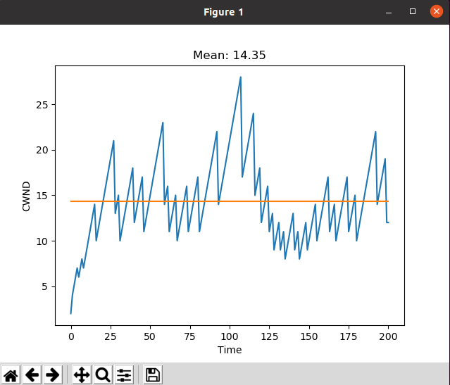

# Network-CA4

## How to run?

Go to desired directory and run this:
```
make run
```

## Simulator

For all parts we use some classes and structs to simulate all scenarios:
- TCP_BBR_Simulator:
```c++
class TCP_New_Reno_Simulator
{
public:
    TCP_Simulator() {}
    void simulate(int num_packets, double packet_loss_rate, string output_file_name)
    {
        // open file as output
        FILE* output_file = fopen(output_file_name.c_str(), "w");

        // create packets
        vector<Packet> packets = create_packets(num_packets, packet_loss_rate);

        TCP tcp_;

        int last_successfullly_sent_packet = 1;    
        for (int i = 0; i < num_packets; i++) 
        {
            // send packet
            Packet packet = packets[i];
            if (!packet.is_lost) 
                last_successfullly_sent_packet = i + 2;

            packet.ack_num = last_successfullly_sent_packet;

            tcp_.handle_ack_packet(packet);
            cout << "cwnd: " << tcp_.get_cwnd() << endl;
            cout << "ssthresh: " << tcp_.get_ssthresh() << endl;
            cout << "ssthresh: " << packet.is_lost << endl << endl;

            // write in a result.txt file
            fprintf(output_file, "%zu\n",tcp_.get_cwnd());

        }
        fprintf(output_file, "%zu",tcp_.get_cwnd());
        fclose(output_file);
    }
};
```

- create_packets:
```c++
struct Packet
{
    int seq_num;
    int ack_num;
    double rtt;
    bool is_lost;
};

vector<Packet> create_packets(int num_packets, double packet_loss_rate) 
{
    vector<Packet> packets;
    for (int i = 0; i < num_packets; i++) 
    {
        Packet packet;
        packet.seq_num = i;
        packet.ack_num = -1;
        packet.is_lost = false;
        packets.push_back(packet);
    }
    // packet loss
    for (int i = 1; i < num_packets; i++) 
    {
        double rand_num = (double) rand() / RAND_MAX;
        if (rand_num < packet_loss_rate)
            packets[i].is_lost = true;
    }

    // rtt a random number between 100 and 150
    for (int i = 0; i < num_packets; i++) 
        packets[i].rtt = 100 + (double) rand() / RAND_MAX * 50;

    packets[9].is_lost = true;
    packets[2].is_lost = true;
    
    return packets;
}
```

And we use a script to draw plot:
```python
import matplotlib.pyplot as plt

NUM_OF_SIM = 3

for i in range(1, NUM_OF_SIM + 1):
    # Open the file and read the contents
    with open(f'result{i}.txt', 'r') as f:
        data = f.read()

    # Split the contents by commas and convert to a list of floats
    data = data.split('\n')
    data = [int(x) for x in data]
    print(int(data[1]))

    # Plot the data
    plt.plot(data)
    plt.show()
```
## Reno

- explanation <br> The Reno algorithm is a congestion control algorithm used by TCP (Transmission Control Protocol) to regulate the flow of data between two endpoints on a network. It is one of the most widely used algorithms in modern TCP/IP networks.
The Reno algorithm uses a combination of packet loss detection, slow start, and congestion avoidance techniques to regulate the amount of data that can be transmitted across a network at any given time. When a packet is lost, the algorithm reduces the rate at which new packets are sent until the packet loss subsides. Once the system determines that the network is no longer congested, it gradually increases the transmission rate again until the next packet loss occurs. This process continues throughout the duration of the connection.
Overall, the Reno algorithm helps to ensure that network resources are utilized efficiently and that data is transmitted reliably across the network.

- code <br> 
```c++
class TCP_Reno 
{
private:
    size_t cwnd;
    size_t ssthresh;
    int dup_ack_count;
    double rtt;

    bool time_out() 
    {
        return false;
    }

public:
    TCP_Reno() 
    {
        cwnd = 1;
        ssthresh = INT_MAX;
        rtt = 100;
        dup_ack_count = 0;
    }

    void handle_ack_packet(Packet& packet)
    {
        if (!packet.is_lost)
        {
            dup_ack_count = 0;
            rtt = (rtt + packet.rtt) / 2;
            if (cwnd < ssthresh) 
            {
                cwnd = cwnd * 2;
            } 
            else 
            {
                cwnd += 1;
            }
        } 
        else // packet lost
        {
            dup_ack_count += 1;
            if (dup_ack_count == 2 || time_out()) 
            {
                ssthresh = cwnd / 2 ;
                if (!FAST_START)
                {
                    cwnd = 1;
                }
                else
                {
                    cwnd = ssthresh + 3;
                }
            }
            else
            {
                if (cwnd < ssthresh) 
                {
                    cwnd = cwnd * 2;
                } 
                else 
                {
                    cwnd += 1;
                }
            }
        }
    }

    size_t get_cwnd() 
    {
        return cwnd;
    }

    size_t get_ssthresh() 
    {
        return ssthresh;
    }
};
```

- test <br>
scenario 1: <br>  <br>
scenario 2: <br>  <br>
scenario 3: <br>  <br>

- analysis <br>

The Reno algorithm works by monitoring the number of packets that are sent and the number of acknowledgments (ACKs) that are received. If the number of unacknowledged packets reaches a certain threshold, known as the congestion window (CWND), the algorithm assumes that the network is congested and reduces the CWND by half. This reduces the amount of data that is sent, which in turn reduces the likelihood of congestion.

If a packet is lost, the algorithm enters a state known as fast recovery. In this state, the algorithm sends a series of duplicate ACKs to the sender, indicating that the packet has been received but that there is a gap in the sequence of packets. This triggers the sender to retransmit the lost packet. Once the packet is retransmitted and acknowledged by the receiver, the algorithm exits fast recovery and returns to normal operation.

In general, combination of slow start in begenning, AIMD after congestion, and fast recovery after packet loss, the Reno algorithm is able to effectively manage network congestion and ensure that data is transmitted reliably across the network.

Overall, the Reno congestion control algorithm is effective at managing network congestion and is widely used in modern TCP implementations. However, it has been criticized for being too aggressive in reducing the congestion window, which can lead to reduced throughput and longer delays in some situations. As a result, newer congestion control algorithms, such as New Reno and TCP Cubic, have been developed to address some of these issues.


- performance <br>
In average time it takes 2.7 seconds to run all scenarios and log in terminal.


## New Reno

- explanation <br> New Reno is an enhancement to the original Reno congestion control algorithm used by TCP. It was introduced in 2000 and is designed to improve the performance of TCP over high-speed networks.
The key difference between original Reno and New Reno is that New Reno uses a more efficient mechanism for handling packet retransmission. In original Reno, when a packet is lost, TCP enters a "fast recovery" mode where it sends a single new packet followed by a series of duplicate acknowledgements (ACKs) to inform the sender that the packet has been received. This can be inefficient because it results in the sender waiting to receive multiple ACKs before resuming normal transmission.
In contrast, New Reno allows the sender to continue transmitting new packets while waiting for ACKs to arrive for the lost packet. This improves efficiency because it reduces the amount of time the sender spends waiting for ACKs, allowing it to transmit more data in a given period of time.
Overall, New Reno is designed to provide more efficient and faster response to network congestion, making it well-suited for high-speed networks.

- code <br>
```c++
class TCP_New_Reno 
{
private:
    size_t cwnd;
    size_t ssthresh;
    int dup_ack_count;
    int new_reno_count;
    double rtt;

    bool time_out() 
    {
        return false;
    }

public:
    TCP_New_Reno() 
    {
        cwnd = 1;
        ssthresh = INT_MAX;
        rtt = 100;
        new_reno_count = 0;
        dup_ack_count = 0;
    }

    void handle_ack_packet(Packet& packet)
    {
        cout << "new_reno_count: " << new_reno_count << endl;
        if (!packet.is_lost)
        {
            new_reno_count ++;
            dup_ack_count = 0;
            rtt = (rtt + packet.rtt) / 2;
            if (cwnd < ssthresh) 
            {
                cwnd = cwnd * 2;
            } 
            else 
            {
                cwnd += 1;
            }
        } 
        else // packet lost
        {
            dup_ack_count += 1;
            if (new_reno_count >= RENO_COUNT_LIMIT)
            {
                new_reno_count = 0;
                if (dup_ack_count >= 0 || time_out()) 
                {
                    ssthresh = cwnd / 2 ;
                    if (!FAST_START)
                    {
                        cwnd = 1;
                    }
                    else
                    {
                        cwnd = ssthresh + 3;
                    }
                }
                else
                {
                    if (cwnd < ssthresh) 
                    {
                        cwnd = cwnd * 2;
                    } 
                    else 
                    {
                        cwnd += 1;
                    }
                }
            }
            else
            {
                // DO NOTHING
            }    
        }
    }

    size_t get_cwnd() 
    {
        return cwnd;
    }

    size_t get_ssthresh() 
    {
        return ssthresh;
    }
};
```

- test <br>
scenario 1: <br>  <br>
scenario 2: <br>  <br>
scenario 3: <br>  <br>

- analysis <br> 

The main improvement of New Reno over Reno is in its handling of fast recovery. In Reno, when a packet is lost, the algorithm enters fast recovery and sends a series of duplicate ACKs to the sender. This can cause the sender to retransmit packets unnecessarily, which can lead to further congestion and reduced throughput.

when a packet is lost, New Reno enters fast recovery and sends a single new packet followed by a series of duplicate ACKs to the sender. This allows the sender to continue transmitting new packets while waiting for ACKs to arrive for the lost packet. This improves efficiency because it reduces the amount of time the sender spends waiting for ACKs, allowing it to transmit more data in a given period of time.

- performance <br> 
In average time it takes 2.9 seconds to run all scenarios and log in terminal.

## BBR

- explanation <br> BBR (Bottleneck Bandwidth and Round-trip propagation time) is a congestion control algorithm for TCP developed by Google. It is designed to optimize network bandwidth utilization while maintaining low latency.
Unlike traditional congestion control algorithms, which rely on packet loss as an indicator of network congestion, BBR uses measurements of the available network bandwidth and round-trip time delay to determine the optimal sending rate for data transmission. This allows BBR to achieve higher throughput with less delay and fewer packet losses.
BBR works by estimating the bottleneck bandwidth and round-trip time of the network path, and then calculating the appropriate sending rate based on these parameters. It uses a variant of the TCP cubic congestion control algorithm when it detects that there is no competing traffic on the network, but switches to its own algorithm when competing flows are detected.
BBR has been shown to improve the performance of TCP on a wide range of network types, including wired and wireless networks, and has been adopted by several major internet companies.

- code <br>
```c++
class TCP_BBR {
public:
    TCP_BBR()
    {
        cwnd = 100;
        ssthresh = INT_MAX;
        rtt_ = 1;
        min_rtt = 0;
        round_start_time = chrono::steady_clock::now();
        next_send_time = round_start_time + chrono::microseconds(
              static_cast<int>(cwnd * 1000000.0 / rtt_));
    }

    void packet_sent() {
        if (chrono::steady_clock::now() >= next_send_time) 
        {
            // Time to send a new packet
            next_send_time = chrono::steady_clock::now() +
                chrono::microseconds(static_cast<int>(
                    cwnd * 1000000.0 / rtt_));
        }
    }

    void handle_ack_packet(bool is_lost)
    {
        if(!is_lost)
        {
            auto now = chrono::steady_clock::now();
            float rtt = chrono::duration_cast<chrono::microseconds>(
                now - round_start_time).count() / 1000.0;

            if (min_rtt == 0) 
            {
                min_rtt = rtt;
            } 
            else 
            {
                min_rtt = min(min_rtt, rtt);
            }

            float bytes_acked = cwnd * rtt / min_rtt;
            float k = pow(cwnd, 3.0 / 4.0) /
                sqrt(bytes_acked * 0.9 + cwnd * cwnd * 0.1);
            cwnd += k;
            cwnd = min(cwnd, ssthresh);

            round_start_time = now;
        }
        else
        {
            cwnd *= 0.5;
        }
    }

    float get_cwnd()
    {
        return cwnd;
    }

    float get_ssthresh()
    {
        return ssthresh;
    }

private:
    float cwnd; // congestion window
    float ssthresh;
    float rtt_;
    float min_rtt;

    chrono::time_point<chrono::steady_clock> round_start_time;
    chrono::time_point<chrono::steady_clock> next_send_time;
};
```

- test <br>
scenario 1: <br>  <br> 
scenario 2: <br>  <br> 
scenario 3: <br>  <br> 

- analysis <br>
We can look at several metrics including throughput, delay, and packet loss. Throughput refers to the amount of data that can be transmitted over the network per unit time. Delay is the time it takes for a packet to travel from the source to the destination, while packet loss refers to the percentage of packets that are lost during transmission.
Several studies have shown that the BBR algorithm can achieve higher throughput compared to other congestion control algorithms such as Reno. This is because BBR uses both the available bandwidth and round-trip time to calculate the optimal sending rate for data packets. By doing so, BBR avoids underutilizing the network or causing congestion, which can lead to increased delay and packet loss.
In terms of delay, the BBR algorithm has been shown to reduce the average round-trip time compared to other congestion control algorithms. This is because BBR tends to maintain a continuous flow of data packets without causing congestion, which can lead to increased queuing delay.
Finally, regarding packet loss, the BBR algorithm has been shown to perform better than other congestion control algorithms. This is because BBR reduces the rate of packet loss by ensuring that the sending rate of data packets is optimized based on the available bandwidth and round-trip time.
Overall, the BBR algorithm has demonstrated excellent performance in terms of throughput, delay, and packet loss, making it a popular choice for many modern TCP/IP networks.


- performance <br>
In average time it takes 1.8 seconds to run all scenarios and log in terminal.

## Questions

* Explain the difference between congestion control and flow control. Answer: <br> 

    Purpose: The main purpose of congestion control is to prevent network congestion, which occurs when there is more traffic on a network than it can handle, leading to packet loss, delays, and reduced throughput. Flow control, on the other hand, is used to regulate the flow of data between two devices so that the receiver is not overwhelmed with data.

    Scope: Congestion control is a global mechanism that operates at the network level to manage the overall traffic on the network. Flow control, on the other hand, is a local mechanism that operates at the link level to regulate the flow of data between two adjacent devices.

    Control Points: In congestion control, the control points are usually routers or switches that monitor the traffic on the network and adjust the transmission rates based on the amount of traffic being generated. In flow control, the control points are usually the sending and receiving devices that negotiate the transmission rates based on their respective buffer sizes.

    Feedback Mechanism: Congestion control typically uses an end-to-end feedback mechanism that relies on the acknowledgement of received packets to adjust the transmission rates. Flow control, on the other hand, uses a sliding window protocol that enables the receiver to signal the sender about its buffer status and adjust the transmission rates accordingly.

    Goals: The goal of congestion control is to maximize the utilization of the network while maintaining acceptable levels of performance, such as low packet loss and low delay. The goal of flow control is to optimize the utilization of the link by preventing the receiver from being overwhelmed with data, thus avoiding unnecessary retransmissions and delays.


* Describe the New Reno algorithm. Answer: <br> It's answered in above.

* Describe the BBR algorithm. Answer: <br> 
It's answered in above.

* Explain the difference between these three algorithms. Answer: <br> 

* Based on the outputs of step 6 of implementation for each algorithm, analyze and compare these three algorithms under the same conditions. Which algorithm had the best and which one had the worst performance? Can it be said in general that one of these three algorithms is always superior to the other two algorithms? Explain your reason by examining different modes, changing different criteria and by mentioning the values. Analyze the output of the relevant code.  
Answer: <br>
Part 1 and 2: <br> As the amount of packet loss increases, the New Reno algorithm degrades more than Reno. While in terms of low packet loss, BBR is better than Reno. In excution time we have: $New Reno < Reno < BBR$ <br>
Part 3: No, it depends on our network status. If the packet loss rate is high, the New Reno algorithm performs better than the other two algorithms and its average cwnd is higher. While if this number is low, the BBR algorithm works better than the other two algorithms (almost twice). The fact that New Reno works better in conditions of high packet loss does not mean that its average cwnd will increase. Rather, it means that you see less impact. <br>
Part 4: <br> BBR vs Reno : One of the main benefits of BBR over Reno is improved network throughput. BBR uses a model-based approach to congestion control, which allows it to better utilize available bandwidth while minimizing packet loss. This can result in higher throughput and lower latency compared to Reno, particularly on networks with high bandwidth-delay products.
Another benefit of BBR is its ability to respond quickly to changes in network conditions. BBR's model-based approach allows it to adapt to changes in available bandwidth and delay more quickly than Reno. This means that BBR can maintain high throughput and low latency even in dynamic network environments.
Finally, BBR has been shown to be more fair to other flows sharing the same network compared to Reno. BBR achieves this by using pacing, which helps to prevent bursts of packets that can cause congestion and unfairness to other flows.
Overall, BBR offers several benefits over Reno, including improved network throughput, faster response to changes in network conditions, and better fairness to other flows. <br>
Reno vs New Reno : One of the main benefits of New Reno over Reno is that it incorporates Fast Retransmit and Fast Recovery mechanisms. These mechanisms allow New Reno to recover from packet loss more quickly than Reno, which can result in improved throughput and lower latency.
Another benefit of New Reno is its improved handling of congestion events. New Reno uses a modified congestion avoidance mechanism that allows it to more quickly detect and respond to congestion events. This can result in less packet loss and faster recovery times compared to Reno.
Additionally, New Reno includes modifications that make it more robust in situations where packets are reordered or lost due to network congestion. For example, New Reno includes a reordering threshold that allows it to detect when packets have been reordered and adjust its congestion window accordingly.
Overall, New Reno offers several benefits over the original Reno congestion control algorithm, including faster recovery from packet loss, improved handling of congestion events, and increased robustness in scenarios with packet reordering or loss.

* Review some congestion control algorithms not covered in this exercise. Name one of these algorithms that you think is superior to Reno, New Reno, BBR algorithms in at least one criterion and justify your reason.:  <br> 
Answer: <br>
Part 1: <br> 
1- CUBIC: CUBIC is a congestion control algorithm that uses a cubic function to determine the congestion window size. It is designed to be scalable and fair in high-speed networks. <br>
2- DCTCP (Data Center TCP): DCTCP is a congestion control algorithm designed for use in data center networks. It uses ECN (Explicit Congestion Notification) to detect congestion and adjust the sending rate accordingly. <br>
Part 2: <br> 
If we consider BBR and CUBIC, while both algorithms have their strengths, CUBIC has been shown to outperform BBR in certain scenarios, such as in high-speed networks with large bandwidth-delay products. In these conditions, CUBIC can more effectively utilize available bandwidth and maintain low latency. <br>
Also We can consider DCTCP and Reno. One of the main benefits of DCTCP over Reno is its ability to detect and respond to congestion much faster and more accurately. Because DCTCP measures congestion directly at the switches in the network, it can respond to congestion before it leads to packet loss or increased latency. This results in higher throughput, lower packet loss, and lower latency, making DCTCP well-suited for data center environments that require fast and reliable data transmission.
In addition, DCTCP is designed to work well with modern network architectures that use shallow-buffered switches, which can suffer from high levels of congestion if not managed properly. DCTCP's congestion control mechanism is specifically designed to prevent such congestion from occurring, resulting in improved network performance and stability.